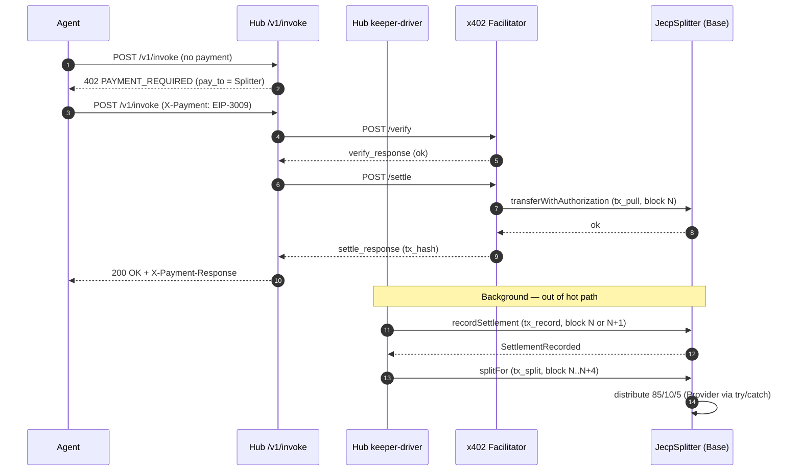

# JECP Spec v1.1.0-rc3 — Errata to 06-x402-integration.md

> **Status**: Normative. Applies to `spec/06-x402-integration.md` as published in `jecp-spec@v1.1.0-rc2` (retracted) and folds into `jecp-spec@v1.1.0-rc3` as the canonical text. This errata document is republished verbatim as a top-level section of `06-x402-integration.md` in the rc3 tag; the standalone file is preserved here for change-tracking and bisection.
> **Trigger**: External review (2026-05-16) identified three architectural defects in v1.1.1's `AUTHORIZED_SETTLER` definition. Admiral approval of Option (b) Pull-to-treasury + Hub keeper recordSettlement (2026-05-16) closes ADR-0003 OQ via Am-7.
> **Wire format**: Unchanged. SDK / CLI behavior unchanged. Provider integration unchanged.

---

## E.1 §6.1 errata — `AUTHORIZED_SETTLER` redefinition

### E.1.1 Normative redefinition

The definition of `AUTHORIZED_SETTLER` in §8.2 (Roles and immutability) is replaced by the following normative text. References to `AUTHORIZED_SETTLER` elsewhere in §6, §7, §8, and §11 are reinterpreted accordingly without textual edit.

> **`AUTHORIZED_SETTLER`** — `address` (immutable on Splitter v1, verified via `JecpSplitter.sol` line 61 `address public immutable AUTHORIZED_SETTLER`). The Hub-controlled keeper EOA whose private key is held exclusively in AWS KMS. The ONLY address permitted to invoke `recordSettlement()`. The keeper EOA MUST NOT be the x402 facilitator, MUST NOT be any address from the x402.org facilitator fleet, and MUST NOT hold any role on `HUB_TREASURY`, `NETWORK_RESERVE`, `RELAYER`, or `RELAYER_ADMIN` (separation-of-duties MUST be enforced at key generation time). Rotation of the keeper EOA is permitted only via Splitter v2 deploy and capability re-registration ceremony per ADR-0003 Am-7; no on-chain setter exists on Splitter v1.

The previous definition — `AUTHORIZED_SETTLER` as the x402 facilitator's settlement contract address or EOA — is **retracted**. v1.1.1 implementations that wired `AUTHORIZED_SETTLER` to a facilitator-controlled address MUST upgrade to v1.1.0-rc3 (Hub keeper EOA) before mainnet deploy.

### E.1.2 Rationale (informative)

x402.org operates a multi-operator facilitator fleet on BaseScan — observed: Canza, Coinbase, Daydreams, X402rs — under the shared label pattern `x402 Facilitator N`. Coinbase-operated EOAs use non-consecutive numbering (e.g., 3, 4, 7), confirming the fleet is multi-organization and dynamic. The x402 specification's `/verify` + `/settle` API surface does not include a facilitator-initiated post-pull contract call; the x402 README design principles explicitly forbid the facilitator from moving funds outside client intentions. The v1.1.1 design — wiring `AUTHORIZED_SETTLER` to a facilitator-controlled address — is therefore non-implementable against x402.org as deployed and would invert x402's published trust model. The errata redefines the role to a Hub-controlled keeper that drives `recordSettlement` from a bounded background loop *after* the facilitator's settle leg confirms on-chain, preserving the v1.1.1 "Hub holds no key on the request hot path" invariant (the keeper EOA is off the synchronous `POST /v1/invoke` path).

### E.1.3 Examples

**Example 1 — Splitter v1 constructor invocation (Foundry deployment script)**

```solidity
new JecpSplitter({
    usdc:               0x833589fCD6eDb6E08f4c7C32D4f71b54bdA02913, // USDC on Base
    hubTreasury:        0xHUB_TREASURY_GNOSIS_SAFE_2_OF_3,
    networkReserve:     0xNETWORK_RESERVE_GNOSIS_SAFE_2_OF_3,
    relayer:            0xRELAYER_KMS_EOA,                          // gas-payer only
    relayerAdmin:       0xRELAYER_ADMIN_GNOSIS_SAFE_2_OF_3,
    authorizedSettler:  0xKEEPER_KMS_EOA,                           // Hub-controlled, per Am-7
    perTxCap:           1_000_000_000                               // $1000 in atomic USDC
});
```

`authorizedSettler` and `relayer` MUST be distinct addresses derived from distinct KMS asymmetric keys.

**Example 2 — Valid `recordSettlement` invocation (Hub keeper-driver, Rust pseudo-code)**

```rust
// services/x402_keeper.rs — driver, fires after facilitator /settle confirms on-chain
let signer = AwsKmsRelayerSigner::new(env!("JECP_HUB_KEEPER_KMS_KEY_ID")).await?;
let splitter = JecpSplitter::new(env!("JECP_SPLITTER_ADDRESS"), &signer);
let tx = splitter.recordSettlement(capability_id, amount_atomic_usdc)
    .send().await?
    .with_required_confirmations(1)
    .await?;
// txn from msg.sender == AUTHORIZED_SETTLER == keeper EOA; reverts UnauthorizedSettler otherwise
// PER_TX_CAP enforced on-chain (L293): amount > cap reverts AmountExceedsCap
```

**Example 3 — Invalid invocation (rejected on-chain)**

```
caller:  0xX402_FACILITATOR_3  (any x402.org facilitator EOA — Coinbase, Canza, Daydreams, X402rs, ...)
action:  recordSettlement(cap_xyz789, 200000)
result:  revert UnauthorizedSettler(msg.sender)
```

Same revert for any non-keeper caller, including the `RELAYER`, `RELAYER_ADMIN`, `HUB_TREASURY`, `NETWORK_RESERVE`, and any agent / Provider EOA.

### E.1.4 Figure (textual description for inclusion in spec)

A sequence diagram MUST accompany E.1 in §8.1 of the consolidated rc3 text. Description:

```
Actors (top-to-bottom lanes): Agent | Hub /v1/invoke | Hub keeper-driver | x402 Facilitator | JecpSplitter (Base)

Step 1  Agent  -> Hub /v1/invoke         : POST (no payment) — 402 challenge with pay_to = Splitter
Step 2  Hub    -> Agent                   : 402 PAYMENT_REQUIRED + payment.accepts[]
Step 3  Agent  -> Hub /v1/invoke         : POST with X-Payment (base64 EIP-3009 sig)
Step 4  Hub    -> Facilitator /verify    : verify EIP-3009 envelope
Step 5  Facilitator -> Hub               : verify_response (signature_valid = true)
Step 6  Hub    -> Facilitator /settle    : execute EIP-3009 transferWithAuthorization
Step 7  Facilitator -> Splitter (Base)   : transferWithAuthorization(from=agent, to=Splitter, value=amount, ...)
Step 8  Facilitator -> Hub               : settle_response (tx_hash, success)
Step 9  Hub    -> Agent                   : 200 OK + X-Payment-Response  (HOT PATH ENDS HERE)
...
Step 10 Keeper-driver (background, after on-chain confirmation, ≥1 confirmation):
        Keeper-driver -> Splitter (Base) : recordSettlement(capabilityId, amount)
                                            msg.sender = AUTHORIZED_SETTLER = keeper EOA (KMS-signed)
                                            on-chain check: amount <= PER_TX_CAP (L293)
Step 11 Splitter -> emit SettlementRecorded(capabilityId, amount, payer)
Step 12 Keeper-driver -> Splitter (Base) : splitFor(capabilityId, payer)
                                            permissionless; reads accountedBalance, zeroes (CEI), distributes
Step 13 Splitter -> Provider / Treasury / Reserve : USDC transfers (Provider via try/catch → escrow on revert)

Latency invariant: Steps 10–13 complete within ≤2 Base blocks of Step 7 (typical ~3 s, best case
single-block when block timing aligns). NOT same transaction. See E.2.
```

---

## E.2 §7.3 errata — Settlement timeline

### E.2.1 Normative correction

Where §4.5 (Atomicity), §8.1 (Architecture), and §1 (Abstract) of `06-x402-integration.md` state "single-block atomic", the canonical reading is replaced by:

> Settlement of an x402-paid invoke is **on-chain within ≤ 2 Base blocks** (≈ 6 s) of the facilitator's `/settle` response. The pull leg (`transferWithAuthorization`) and the ledger-update leg (`recordSettlement`) are **two distinct transactions** submitted by two distinct senders (facilitator and Hub keeper, respectively). When block timing aligns, both transactions land in the same Base block (best case ≈ 3 s end-to-end); when they do not, ledger update lands in the next block (worst case ≈ 6 s). Implementations MUST NOT claim "same-transaction atomic"; MUST NOT claim "instant"; MAY claim "≤ 2-block on-chain settlement"; MAY claim "single-block on-chain settlement" only when reporting an observed measurement that fell within one block. The `splitFor` leg (distribution to Provider / Treasury / Reserve) is a third transaction, submitted permissionlessly after `recordSettlement` confirms, and MUST complete within ≤ 4 Base blocks of the pull leg (≈ 12 s p99).

The previous phrasing "single-block atomic" remains in §1, §4.5, §8.1 as a marketing-grade summary and MUST be read in light of E.2 when integrating against the wire protocol. The strictly normative timing invariant is the "≤ 2-block on-chain settlement" form above.

### E.2.2 Sequence diagram (mermaid)

The rc3 consolidated text MUST include this mermaid block adjacent to §8.1:



### E.2.3 Invariant (added to §8.11)

Append to the existing invariant list in §8.11:

- **I-6** (settlement timing): For every successful x402 invoke with facilitator `/settle` response timestamp `T_settle`, `recordSettlement` MUST emit `SettlementRecorded` at block `B` such that `block.timestamp(B) ≤ T_settle + 6 s` (≤ 2 Base blocks). The Hub keeper-driver MUST raise `X402_RECONCILER_MISMATCH_FLAGGED` if the bound is violated. Implementations MAY use `block.number` ≤ `pullBlock + 2` as an equivalent enforcement.

---

## E.3 §11 errata — Reconciler reclassification + invariant I-7

### E.3.1 Reconciler reclassification

Throughout `06-x402-integration.md` §6.2 and the closely-related text in §1, §4.4, §8.1, §8.11, the term "reconciler" describing `services/x402_reconciler.rs` is **redefined**. v1.1.1's reconciler was a passive **watcher** that observed USDC `Transfer` events and flagged mismatches. v1.1.0-rc3 splits the responsibility:

- **`services/x402_reconciler.rs`** (existing module, unchanged scope) — continues as the passive watcher: observes on-chain `Transfer` events, populates `x402_pull_events` table, flags discrepancies. NO recordSettlement call.
- **`services/x402_keeper.rs`** (NEW module per rc3) — the active **keeper-driver**: reads `x402_pull_events`, derives the keeper EOA via AWS KMS, signs and submits `recordSettlement(capabilityId, amount)` transactions, then submits `splitFor(capabilityId, payer)` to distribute. Bounded background loop, off the hot path.

Normative text replacement:

> The Hub keeper-driver (`services/x402_keeper.rs`) is an active component that, in addition to the existing reconciler watcher's cross-check duties (`eth_getTransactionReceipt` verification, mismatch flagging, kill-switch participation), **MUST drive the on-chain `recordSettlement(capabilityId, amount)` call from the Hub keeper EOA** for every facilitator `/settle` success observed by the reconciler watcher. The keeper-driver MUST treat `recordSettlement` as an at-least-once obligation: on transient RPC failure it MUST retry with exponential backoff (initial 1 s, factor 2, jitter ±20 %, max 60 s) for up to 4 Base blocks (≈ 12 s) before flagging `X402_RECONCILER_MISMATCH_FLAGGED`. Duplicate `recordSettlement` calls for the same `(capabilityId, tx_hash)` are de-duplicated by the on-chain `usedNonces` mapping per Am-2 *and* by the keeper-driver's `x402_pull_events.tx_hash UNIQUE` constraint per Sprint 12 idempotency precedent; the off-chain at-least-once semantics combined with both idempotent guards yield exactly-once settlement-recording from the agent's perspective.

The split between watcher (`reconciler.rs`) and driver (`keeper.rs`) is for failure-mode isolation: passive observation crash-restarts cleanly, active signing has in-flight ordering concerns. See `IMPLEMENTATION-RUNBOOK.md` Day 1 for the module boundary rationale.

### E.3.2 New invariant I-7 (amount attribution)

Append to §8.11:

- **I-7** (amount attribution): For every `(capabilityId, payer, tx_hash)` triple observed in `SettlementRecorded` events, the `amount` parameter recorded on-chain MUST equal the `value` field of the corresponding EIP-3009 `transferWithAuthorization` settled by the facilitator. The Hub keeper-driver MUST refuse to call `recordSettlement` if its locally-computed expected amount disagrees with the on-chain `Transfer` log emitted by USDC during the pull leg; on disagreement it MUST flag `X402_RECONCILER_MISMATCH_FLAGGED` subcause `amount_attribution_violation` and MUST NOT retry. Rationale: prevents a malicious or buggy facilitator from pulling $0.20 and convincing the Hub to record $0.02 (provider underpay) or $2.00 (provider overpay / Hub overdraft) by misrepresenting the amount in the off-chain settle_response. The on-chain `Transfer` log is the ground truth; the off-chain settle_response is advisory.

### E.3.3 Conformance assertions

Five conformance assertions are added in v1.1.0-rc3 (see `conformance/x402/`):

- `X402_HUB_KEEPER_AUTHORIZED_SETTLER_MATCH.yaml`
- `X402_FACILITATOR_NOT_TRUSTED_AS_SETTLER.yaml`
- `X402_RECORD_SETTLEMENT_IDEMPOTENT.yaml`
- `X402_RECORD_SETTLEMENT_LATENCY_BOUND.yaml` (I-6 enforcement, p99 < 30 s end-to-end)
- `X402_AMOUNT_ATTRIBUTION_INVARIANT.yaml` (I-7 enforcement)

Total v1.1.0-rc3 x402 suite: **27 assertions** (22 inherited from rc2 + 5 new).

---

## E.4 RFC 2119 keyword audit

Every MUST / SHOULD / MAY in E.1–E.3 carries the RFC 2119 meaning verbatim.

| Clause | Keyword | Subject |
|---|---|---|
| E.1.1 | MUST NOT | `AUTHORIZED_SETTLER` is the x402 facilitator |
| E.1.1 | MUST NOT | `AUTHORIZED_SETTLER` overlaps with `RELAYER` / `RELAYER_ADMIN` / `HUB_TREASURY` / `NETWORK_RESERVE` |
| E.1.1 | MUST | rotation via Splitter v2 ceremony only (no setter on v1) |
| E.2.1 | MUST NOT | implementations claim "same-transaction atomic" |
| E.2.1 | MUST NOT | implementations claim "instant" |
| E.2.1 | MAY | implementations claim "≤ 2-block on-chain settlement" |
| E.2.1 | MAY | implementations claim "single-block on-chain settlement" *only when reporting an observed measurement* |
| E.2.3 (I-6) | MUST | `recordSettlement` lands within ≤ 6 s of settle response |
| E.2.3 (I-6) | MUST | keeper-driver flags violation |
| E.3.1 | MUST | keeper-driver drives `recordSettlement` |
| E.3.1 | MUST | at-least-once retry with bounded backoff |
| E.3.2 (I-7) | MUST | amount matches USDC `Transfer` log |
| E.3.2 (I-7) | MUST NOT | retry on amount mismatch |

---

## E.5 Backward compatibility

E.1, E.2, E.3 are **wire-invariant**. No change to:

- 402 challenge envelope shape (§2.1)
- `payment.accepts[].pay_to` value (still the Splitter address)
- `X-Payment` request header (§3)
- `X-Payment-Response` response header (§5)
- agent-guide.json `payment.x402` block (§7.3, §05-discovery §4.4.1)
- error catalog § 3.8 (5 codes, 19 subcauses; one new subcause added: `amount_attribution_violation` under `X402_RECONCILER_MISMATCH_FLAGGED`, which is permitted per the closed-registry extension rule in §3.8.6)

SDK `@jecpdev/sdk@0.8.x` requires **zero changes** to remain conformant with rc3. CLI `@jecpdev/cli@0.7.x` requires zero changes. Provider integration (EIP-712 register flow) is unchanged. Hubs upgrading from rc2 to rc3 MUST redeploy the Splitter contract with the new `AUTHORIZED_SETTLER` immutable; existing Splitter v1.1.1-rc2 deployments (if any reached mainnet — none should have, per the handoff retract gate) MUST be migrated per Am-7 §3 (Rotation procedure).
